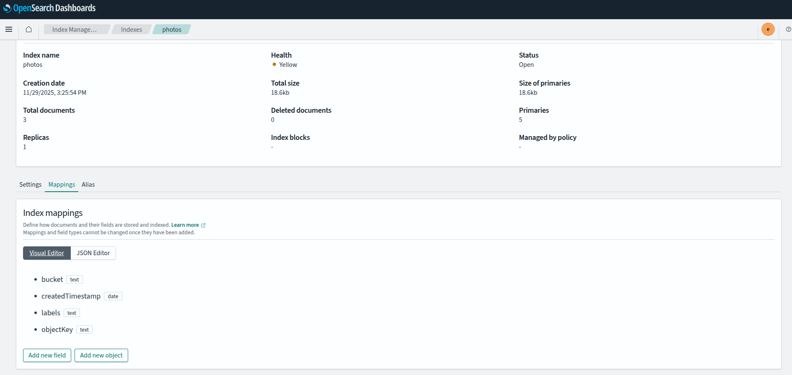
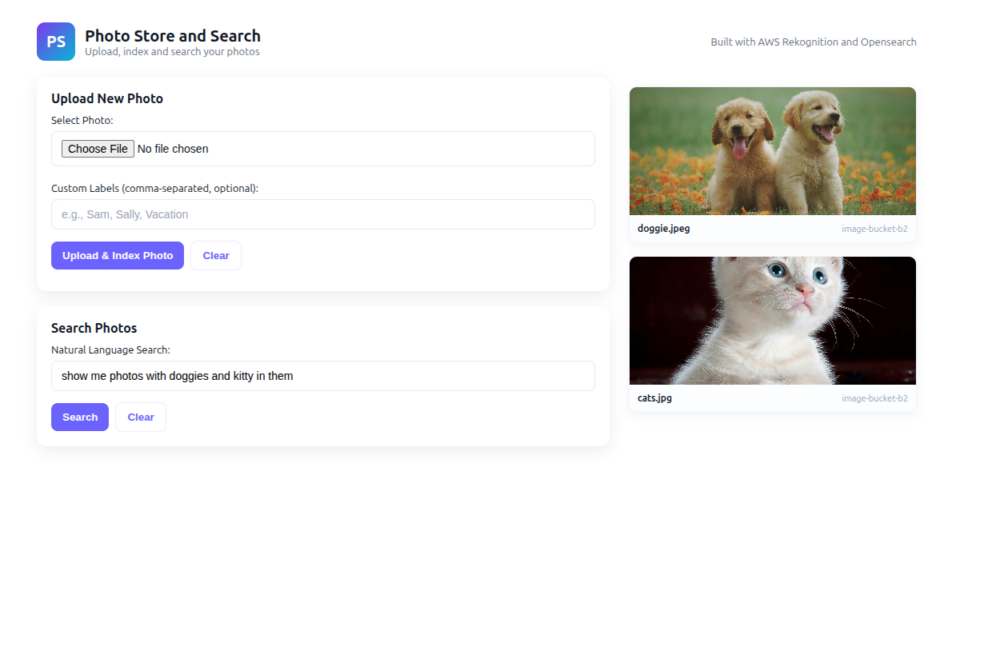
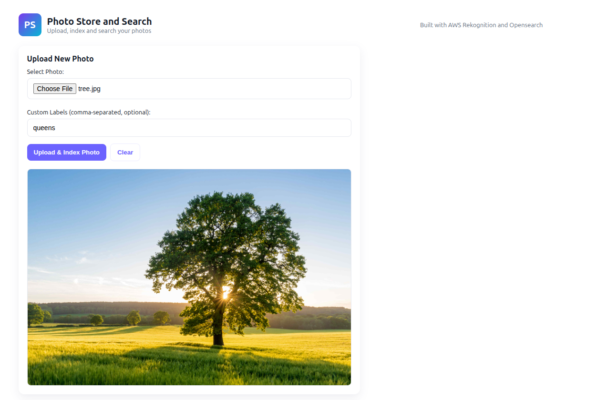
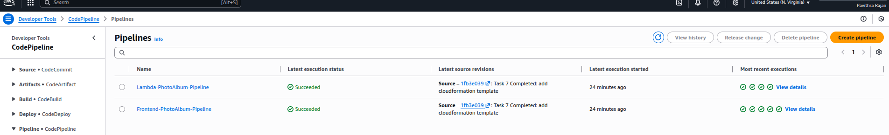
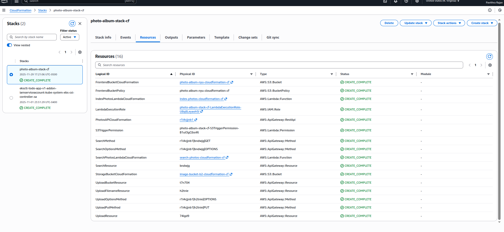

# CS-GY-9223-Cloud-Assg3-Album
This repository contains the codebase for CS-GY 9223 Cloud Computing Assignment 3. This is a photo album web application, that can be searched using natural language text. Lex, ElasticSearch, and Rekognition are used create an intelligent search layer to query photos for people, objects, actions, landmarks and more.

## Task 1: Opensearch
- Create a domain in AWS Opensearch to index the metadata of the photos to be indexed. 



## Task 2: Upload and Index Photos
- Create an S3 bucket to store the photos.
- Create a lambda function `lambda_function_lf1.py` that handles triggers from the above S3 bucket to index it to Opensearch. 
- Add IAM policies to `ES*` as required as well as `Rekognition` to detect labels.
```
{
	"Version": "2012-10-17",
	"Statement": [
		{
			"Effect": "Allow",
			"Action": [
				"s3:GetObject",
				"s3:GetObjectAcl",
				"s3:GetObjectTagging"
			],
			"Resource": "arn:aws:s3:::image-bucket-b2/*"
		},
		{
			"Effect": "Allow",
			"Action": "s3:ListBucket",
			"Resource": "arn:aws:s3:::image-bucket-b2"
		},
		{
			"Effect": "Allow",
			"Action": [
				"rekognition:DetectLabels"
			],
			"Resource": "*"
		}
	]
}
```
- Each entry in Opensearch is stored as shown
```
{
        "_index": "photos",
        "_id": "2KNL0ZoBeew0N6aWJw69",
        "_score": 1,
        "_source": {
          "objectKey": "cats.jpg",
          "bucket": "image-bucket-b2",
          "createdTimestamp": "2025-11-29T20:25:53.245914",
          "labels": [
            "pet",
            "animal",
            "cat",
            "kitty",
            "kitten",
            "mammal"
          ]
        }
}
```
## Task 3: Search
- Create another lambda function `lambda_function_lf2.py` that handles the search queries. 
- Create an Amazon Lex bot with the `SearchIntent` and utterances to handle natural language queries from the client. This bot will be used by LF2 lambda. 
- Utterances used are as follows:
```
show me photos with {Keyword1}
find photos of {Keyword1}
search for {Keyword1}
show me photos with {Keyword2}
find photos of {Keyword2}
search for {Keyword2}
show me photos with {Keyword1} and {Keyword2} in them
find {Keyword1} and {Keyword2}
Are there photos of {Keyword1} or {Keyword2}
{Keyword1}
{Keyword2}
{Keyword1} photos
{Keyword2} photos
{Keyword1} and {Keyword2}
```
- The slot type of `Keyword1` amd `Keyword2` are `AMAZON.AlphaNumeric`.

## Task 4: API Layer
- Using the `swagger.yaml` create an API gateway with two endpoints `GET` and `PUT`. 
- Set the `API key required` as True in method request settings for both.
- Create an API key, associated usage plan to map the API to the key. 
- Set Binary media types as `image/png`, `image/jpeg`, `image/jpg`
- Enable CORS and deploy after handling the below endpoints individually. 
### PUT
- Set the path override option to `/image-bucket-b2/{object}`.
- Input to `passthrough`
- URL path parameters: `object` mapped to `method.request.querystring.filename`
- HTTP headers as `Content-Type` -> `method.request.header.Content-Type` and `x-amz-meta-customLabels` -> `method.request.header.x-amz-meta-customLabels`
- Integrate S3 service to this endpoint
### Get
- Integrate the search lambda function to this endpoint

## Task 5: Frontend
- Hosted at: https://photo-album-nyu.s3.us-east-1.amazonaws.com/index.html
- Create the SDK for JS from the stages tab from the above API gateway. 
- Use the API key to create the client to form the requests. 
- Create an S3 bucket and deploy the frontend
- Grant public access
```
{
    "Version": "2012-10-17",
    "Statement": [
        {
            "Sid": "PublicReadGetObject",
            "Effect": "Allow",
            "Principal": "*",
            "Action": "s3:GetObject",
            "Resource": "arn:aws:s3:::photo-album-nyu/*"
        }
    ]
}
```


## Task 6: Deploy Code with AWS CodePipeline




## Task 7: Create a AWS CloudFormation template for the stack
- Use `template.yaml` to create a cloudformation stack.
- Add necessary IAM permissions to create lambdas and s3 buckets.


## References
- [Rekognition](https://aws.amazon.com/rekognition/)
- [Configure S3 to publish trigger events](https://docs.aws.amazon.com/lambda/latest/dg/with-s3-example.html)
- [S3 integration with API Gateway](https://repost.aws/knowledge-center/api-gateway-upload-image-s3)
- [Head object in S3](https://docs.aws.amazon.com/AWSJavaScriptSDK/latest/AWS/S3.html#headObject-property)
- [Codepipeline](https://aws.amazon.com/codepipeline/)
- [Cloudformation](https://aws.amazon.com/cloudformation/)